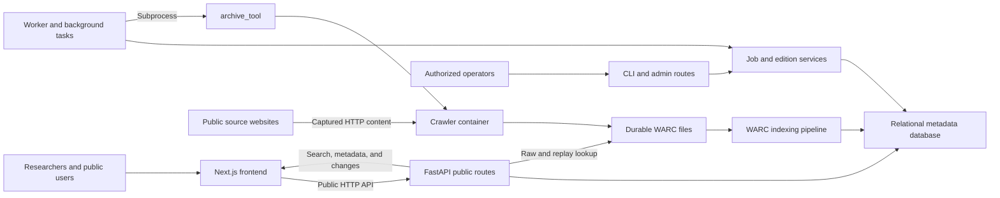
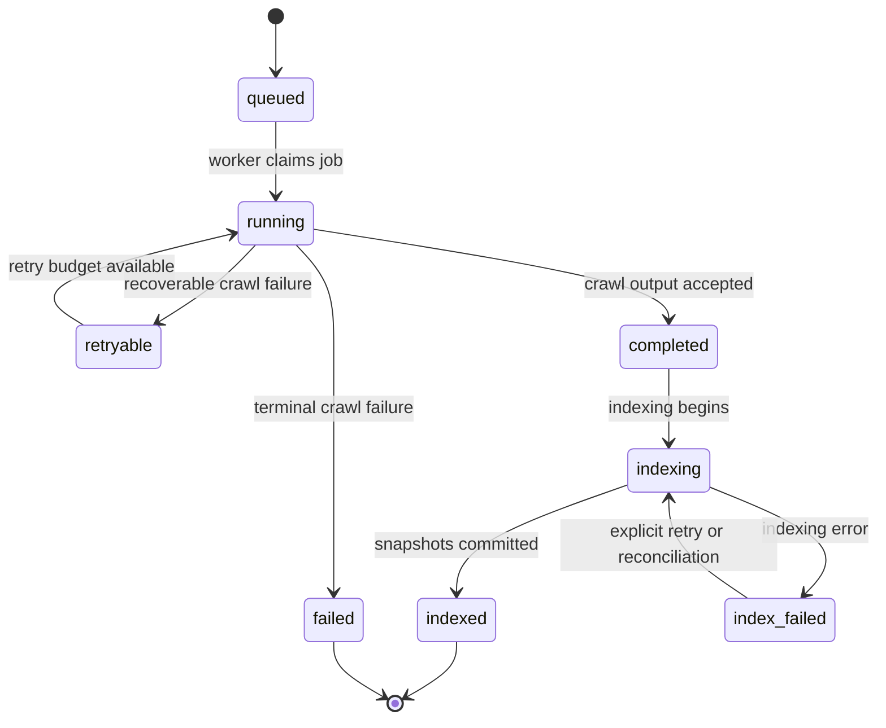

# HealthArchive Backend – Architecture & Implementation Guide

This document is an in‑depth walkthrough of the **HealthArchive.ca backend**
(`healtharchive` repo). It covers:

- How the backend is structured.
- How it integrates with the `archive_tool` crawler subpackage.
- The data model and job lifecycle.
- The indexing pipeline (WARCs → snapshots).
- HTTP APIs (public + admin) and metrics.
- Worker loop, retries, and cleanup/retention (future).

For `archive_tool` internals (log parsing, Docker orchestration, run modes),
see `src/archive_tool/docs/documentation.md`. For a shorter, task‑oriented
overview of common commands and local testing flows, see
`development/live-testing.md`. Deployment details are environment-specific and
kept outside the public docs portal.

Visual references:

- [Architecture walkthrough](tutorials/architecture-walkthrough.md) follows a
  page from job creation through crawl, indexing, and search.
- [Data model reference](reference/data-model.md#entity-relationship) contains
  the full Mermaid entity-relationship diagram.
- [`archive_tool` documentation](https://github.com/jerdaw/healtharchive/blob/main/src/archive_tool/docs/documentation.md)
  covers crawler orchestration and artifact internals.

---

## 1. High‑level architecture

### 1.1 Components

- **archive_tool** (internal subpackage under `src/archive_tool/`):
  - CLI wrapper around `zimit` + Docker.
  - Manages temporary output dirs, WARCs, and final ZIM build.
  - Tracks persistent state in `.archive_state.json` + `.tmp*` directories.
  - Implements stall/error detection, adaptive worker reductions, and VPN
    rotation (when enabled).

- **Backend package** (`src/ha_backend/`):
  - Orchestrates crawl **jobs** using `archive_tool` as a subprocess.
  - Groups annual jobs into **AnnualEdition** records for `{source, year}`.
  - Stores job and snapshot metadata in a relational database via SQLAlchemy.
  - Indexes WARCs into `Snapshot` rows.
  - Exposes HTTP APIs via FastAPI.
  - Provides a worker loop to process queued jobs.
  - Offers CLI commands for admins (job creation, status, retry, cleanup).

- **External dependencies**:
  - Docker & `ghcr.io/openzim/zimit` image.
  - Database (SQLite by default; Postgres recommended in production).
  - Optional VPN client/command for rotation (e.g., `nordvpn`).

### 1.2 System context



The database stores lifecycle and researcher-facing metadata; WARCs remain the
durable captured-content source for indexing and replay. Optional ZIM output is
not a prerequisite for backend search readiness.

#### Replay storage readiness contract

Search metadata, a running replay process, and an HTTP-success replay root do
not establish that archived pages can be replayed. Readiness requires the
referenced WARC targets to be available in the serving process's filesystem
view, followed by representative replay requests. A host mount alone does not
prove container visibility or archive integrity.

The deployment-owned serving manifest must enumerate every retained output
root, including legacy jobs and annual jobs from earlier years. Each entry
identifies the job, source, campaign year when applicable, canonical relative
output root, and intended storage mapping. Entries must be unique and
non-overlapping; removal or replacement requires an explicit continuity
decision. A reviewed, versioned deterministic plan digest can authenticate the
same exact mapping, but a hash computed from newly observed paths is not its
own approval. Actual manifest values and deployment wiring remain private.

The annual campaign tiering helper selects a campaign year and creation window
for crawl preparation. An empty selection is not proof that retained replay
data needs no mounts. It must not serve as an all-years boot-restoration
inventory. Its mount identity check compares filesystem device, type, source,
and relative mount root from one unambiguous mount-table sample; readable
directories and a `bind` label alone are insufficient. Unproven identity on
a readable mounted output is a failure, not permission to unmount it. The
former unexpected-mount repair flag is retained for argument compatibility
but cannot bypass this refusal.

The required startup sequence is storage available, all registered serving
mounts verified, then replay ready. Startup ordering alone is insufficient:
the readiness dependency must fail closed on missing or wrong-source mounts,
including partial restoration after reboot. Report legacy and annual coverage
separately against the complete serving manifest; a successful legacy-only
check must not imply total coverage. Re-prove the same source identities in
the container, and check representative pages from each covered job.

This is an acceptance contract, not a claim that all deployment enforcement
has been installed. The application helper is not a no-data-change incident
repair tool: its separately authorized crawl-preparation/repair modes retain
broader capabilities. Tests use synthetic mount tables without mounting disks
or reading archive bytes. Deployment-specific restoration, locking, rollback,
and reboot/propagation acceptance belong to the private operations workspace;
no worker restart, new capture, or dataset release follows from this contract.

### 1.3 Data flow overview

1. **Job creation**:
   - Admin runs `healtharchive create-job --source hc`.
   - Backend:
     - Ensures a `Source` row exists.
     - Uses `SourceJobConfig` to build seeds, tool options, and `output_dir`.
     - Inserts an `ArchiveJob` with `status="queued"`.

2. **Crawl (archive_tool)**:
   - Worker or CLI runs `run_persistent_job(job_id)`:
     - Builds `archive_tool` CLI args from `ArchiveJob.config` and `output_dir`.
     - Runs `archive_tool` as a subprocess (no in‑process calls).
     - Marks job `running` → `completed` or `failed` with `crawler_exit_code`
       and `crawler_status`.
     - Treats annual search readiness as WARC-first: if a Browsertrix/Zimit
       run reaches a WARC-complete crawl state but optional ZIM finalization
       fails, the backend can accept the job for WARC indexing with crawler
       stage `warc_complete_finalization_failed` when final crawlStatus has
       `pending=0` and discoverable indexable WARCs exist.
   - `archive_tool`:
     - Validates Docker.
     - Determines run mode (Fresh/Resume/New‑with‑Consolidation/Overwrite).
     - Spawns `docker run ghcr.io/openzim/zimit zimit ...`.
     - Tracks temp dirs and state, discovers WARCs, and optionally runs a
       final ZIM build (depending on its configuration).

3. **Indexing (WARCs → Snapshot)**:
   - Worker calls `index_job(job_id)` when crawl succeeds, and also
     reconciles `completed` jobs that were started outside the worker.
   - Backend:
     - Consolidates readable temp WARCs into stable storage where possible.
     - Uses union WARC discovery across stable, temp, and fallback outputs.
     - Streams WARC records, extracts HTML, text, language, etc.
     - Writes `Snapshot` rows for each captured page.
     - Marks job `indexed` with `indexed_page_count`.
   - ZIM output is optional for the backend search/replay pipeline; WARCs are
     the durable source of truth for `Snapshot` rows and raw/replay lookups.

4. **Annual coverage reporting**:
   - Annual edition services attach legacy/full-site jobs as salvage shards or
     create deterministic shard jobs from configured source seeds.
   - Coverage reports write durable JSON/Markdown artifacts next to crawl
     outputs and summarize intended, captured, excluded, and review-needed
     URLs.
   - Public APIs expose the researcher-safe summary. Admin APIs expose shard
     diagnostics and acceptance state.

5. **Change tracking (Snapshot → Change events)**:
   - A background task (`healtharchive compute-changes`) computes **precomputed**
     change events between adjacent captures of the same `normalized_url_group`.
   - Outputs `SnapshotChange` rows with:
     - provenance (from/to snapshot IDs, timestamps),
     - summary stats (sections/lines changed),
     - and a renderable diff artifact when available.
   - This work is intentionally **off the request path** to keep APIs fast.

6. **Serving**:
   - FastAPI app:
     - `GET /api/search` queries `Snapshot` for search results.
     - `GET /api/stats` provides lightweight public archive totals for frontend metrics.
     - `GET /api/sources` summarises captures per `Source`.
     - `GET /api/snapshot/{id}` returns metadata for a single snapshot.
     - `GET /api/snapshots/raw/{id}` replays archived HTML from a WARC.
     - `GET /api/changes` and `GET /api/changes/compare` expose change feeds and diffs.
     - `GET /api/snapshots/{id}/timeline` returns a capture timeline for a page group.

7. **Admin & cleanup**:
   - Admin API:
     - `GET /api/admin/jobs` / `{id}` for job status and config.
     - `GET /metrics` for Prometheus‑style metrics.
   - CLI:
     - `healtharchive retry-job` to reattempt failed jobs.
     - `healtharchive cleanup-job` to delete temp dirs/state for indexed jobs,
       updating `cleanup_status`.

### 1.4 Job lifecycle



`warc_complete_finalization_failed` is a crawler-stage acceptance signal, not
an `ArchiveJob.status`. Once WARC completeness is proven, that condition may
take the normal `running` to `completed` path even though optional ZIM
finalization failed.

---

## 2. Configuration & environment

### 2.1 Config module (`ha_backend/config.py`)

Key roles:

- Locate the **archive root** (`--output-dir` base) and `archive_tool` command.
- Read the **database URL**.

Admin-related configuration is handled separately in `ha_backend/api/deps.py`,
which reads `HEALTHARCHIVE_ADMIN_TOKEN` from the environment. When this token
is **unset**, admin and metrics endpoints fail closed by default. Local
development can opt into tokenless admin access only by setting both a
local/dev/test `HEALTHARCHIVE_ENV` and
`HEALTHARCHIVE_ALLOW_DEV_ADMIN_NO_TOKEN=true`. In staging and production you
should always set `HEALTHARCHIVE_ADMIN_TOKEN` to a long, random value and treat
it as a secret.

#### ArchiveToolConfig

```python
@dataclass
class ArchiveToolConfig:
    archive_root: Path = DEFAULT_ARCHIVE_ROOT
    archive_tool_cmd: str = DEFAULT_ARCHIVE_TOOL_CMD

    def ensure_archive_root(self) -> None:
        self.archive_root.mkdir(parents=True, exist_ok=True)
```

Defaults:

- `DEFAULT_ARCHIVE_ROOT` = repo-local `.dev-archive-root`
- `DEFAULT_ARCHIVE_TOOL_CMD` = `"archive-tool"`

Env overrides:

- `HEALTHARCHIVE_ARCHIVE_ROOT` → archive root.
- `HEALTHARCHIVE_TOOL_CMD` → CLI to call (e.g., `archive-tool`, `python run_archive.py`).

#### DatabaseConfig

```python
@dataclass
class DatabaseConfig:
    database_url: str = DEFAULT_DATABASE_URL
```

Defaults:

- `DEFAULT_DATABASE_URL = "sqlite:///healtharchive.db"` in the repo root.

Env override:

- `HEALTHARCHIVE_DATABASE_URL`.

### 2.2 Logging (`ha_backend/logging_config.py`)

Centralized logging configuration:

- Reads `HEALTHARCHIVE_LOG_LEVEL` (default `INFO`).
- On first call, uses `logging.basicConfig(...)` with:
  - Format: `"%(asctime)s [%(levelname)s] %(name)s: %(message)s"`.
- Adjusts noisy loggers:
  - `sqlalchemy.engine` → `WARNING`.
  - `uvicorn.access` → `INFO`.

Used in:

- `ha_backend.api.__init__` (API startup).
- `ha_backend.cli.main` (CLI entrypoint).

---

## 3. Data model (SQLAlchemy ORM)

Defined in `src/ha_backend/models.py`, with `Base` from `ha_backend.db`.

### 3.1 Source

Represents a logical content origin (e.g., Health Canada, PHAC).

Important fields:

- `id: int` (PK)
- `code: str` – short code (`"hc"`, `"phac"`) – unique, indexed.
- `name: str` – human‑readable name.
- `base_url: str | None`
- `description: str | None`
- `enabled: bool`
- Timestamps: `created_at`, `updated_at`

Relationships:

- `jobs: List[ArchiveJob]` – all jobs for this source.
- `snapshots: List[Snapshot]` – all snapshots for this source.
- `annual_editions: List[AnnualEdition]` – one row per source/year annual
  edition.

### 3.2 AnnualEdition

Represents the researcher-facing annual archive for one source/year. It is
usually built from multiple `ArchiveJob` shards plus any legacy full-site
salvage jobs.

Key fields:

- Identity:
  - `id: int` (PK)
  - `source_id: int` → FK to `sources.id`
  - `year: int`

- Readiness:
  - `status: str` – edition lifecycle (`planned`, `in_progress`,
    `search_ready`, `research_ready`, `needs_review`, etc.).
  - `search_ready: bool` – all blocking shard jobs have indexed searchable
    snapshots.
  - `research_ready: bool` – coverage/provenance review has accepted the
    documented result.

- Coverage summary:
  - `intended_url_count`, `captured_url_count`, `failed_url_count`,
    `excluded_url_count`
  - `backend_counts: JSON | None`
  - `coverage_summary: JSON | None`

- Artifacts:
  - `target_ledger_path`
  - `capture_manifest_path`
  - `coverage_report_json_path`
  - `coverage_report_md_path`

Relationships:

- `source: Source`
- `jobs: List[ArchiveJob]`

### 3.3 ArchiveJob

Represents a single `archive_tool` run for a source. In annual campaigns it is
also a shard belonging to an `AnnualEdition`.

Key fields:

- Identity:
  - `id: int` (PK)
  - `source_id: int | None` → FK to `sources.id`
  - `edition_id: int | None` → FK to `annual_editions.id`
  - `name: str` – must match `--name` for `archive_tool`; used in ZIM naming.
  - `output_dir: str` – host path used as `--output-dir` for `archive_tool`.
  - `shard_key: str | None` – deterministic shard identifier within an edition.
  - `shard_kind: str | None` – e.g. `path-language`, `legacy-full-site`,
    `fallback-fill`.
  - `acceptance_state: str | None` – `pending`, `needs_review`, `accepted`,
    `accepted_gap`, or `excluded`.

- Lifecycle/status:
  - `status: str` – high‑level state; typical values:
    - `queued`
    - `running`
    - `retryable`
    - `failed`
    - `completed` (crawl succeeded)
    - `indexing`
    - `indexed`
    - `index_failed`
  - `queued_at`, `started_at`, `finished_at`: timestamps.
  - `retry_count: int` – number of times the worker retried the crawl.

- Configuration:
  - `config: JSON | None` – “opaque” config used to reconstruct the CLI:

    ```json
    {
      "seeds": ["https://..."],
      "zimit_passthrough_args": ["--profile", "foo"],
      "tool_options": {
        "cleanup": false,
        "overwrite": false,
        "skip_final_build": false,
        "enable_monitoring": false,
        "enable_adaptive_workers": false,
        "enable_vpn_rotation": false,
        "initial_workers": 2,
        "log_level": "INFO",
        "...": "..."
      }
    }
    ```

- Crawl metrics:
  - `crawler_exit_code: int | None` – exit code from the `archive_tool` process.
  - `crawler_status: str | None` – summarised status (e.g. `"success"`, `"failed"`).
  - `crawler_stage: str | None` – last known stage (not heavily used yet).
  - `last_stats_json: JSON | None` – parsed crawl stats from the latest combined log, when available.
  - `pages_crawled`, `pages_total`, `pages_failed`: simple integer metrics derived from `last_stats_json` (best-effort).

- WARC/ZIM counts:
  - `warc_file_count: int` – number of WARCs discovered for this job.
  - `indexed_page_count: int` – number of `Snapshot`s created during indexing.

- Filesystem paths:
  - `final_zim_path: str | None` – if a ZIM is produced by `archive_tool` or manual `warc2zim`.
  - `combined_log_path: str | None` – path to the latest combined log, used for stats/debugging.
  - `state_file_path: str | None` – path to `.archive_state.json` within `output_dir` (may be `None` after cleanup).
  - `coverage_report_path: str | None` – shard or edition report artifact.

- Cleanup state (future):
  - `cleanup_status: str` – describes whether any cleanup has occurred:
    - `"none"` (default) – temp dirs & state still present (or never existed).
    - `"temp_cleaned"` – `cleanup-job` or an equivalent operation removed temp dirs/state.
    - Future values could represent more aggressive cleanup.
  - `cleaned_at: datetime | None` – when cleanup was performed.

Relationships:

- `source: Source | None` – parent source.
- `edition: AnnualEdition | None` – annual edition this job contributes to.
- `snapshots: List[Snapshot]` – all snapshots produced by this job.

### 3.4 Snapshot

Represents a single captured web page (an HTML response) extracted from a WARC.

Key fields:

- Identity:
  - `id: int` (PK)
  - `job_id: int | None` → FK to `archive_jobs.id`
  - `source_id: int | None` → FK to `sources.id`

- URL & grouping:
  - `url: str` – full URL of the capture (including query string).
  - `normalized_url_group: str | None` – optional canonicalised URL for grouping (e.g., removing query or anchors).

- Timing:
  - `capture_timestamp: datetime` – from `WARC-Date` or HTTP headers.

- HTTP & content:
  - `mime_type: str | None`
  - `status_code: int | None`
  - `title: str | None` – extracted from `<title>` or headings.
  - `snippet: str | None` – short preview text.
  - `language: str | None` – ISO language (e.g. `"en"`, `"fr"`).
  - `capture_backend: str | None` – backend that produced the capture
    (`browsertrix`, `playwright_warc`, etc.).
  - `capture_fidelity: str | None` – fidelity label used in reports and public
    exports (`high`, `fallback`, `unknown`).
  - `provenance_json: JSON | None` – structured capture provenance, including
    job/shard metadata.

- Storage / replay:
  - `warc_path: str` – path to the `.warc.gz` file on disk.
  - `warc_record_id: str | None` – WARC record identifier or offset (see `indexing.viewer`).
  - `raw_snapshot_path: str | None` – optional path to a static HTML export, if you create such stubs.
  - `content_hash: str | None` – hash of the HTML body for deduplication.

Relationships:

- `job: ArchiveJob | None`
- `source: Source | None`

---

## 4. Job registry & creation (`ha_backend/job_registry.py`) {: #4-job-registry--creation-ha_backendjob_registrypy }

The job registry defines default behavior and seeds for each source code (`"hc"`, `"phac"`).

### 4.1 SourceJobConfig

```python
@dataclass
class SourceJobConfig:
    source_code: str
    name_template: str
    default_seeds: List[str]
    default_zimit_passthrough_args: List[str]
    default_tool_options: Dict[str, Any]
    schedule_hint: Optional[str] = None
```

Examples:

- `hc` (Health Canada):

  - `name_template = "hc-{date:%Y%m%d}"`
  - `default_seeds = ["https://www.canada.ca/en/health-canada.html"]`
  - `default_tool_options`:
    - `cleanup = False`
    - `overwrite = False`
    - `enable_monitoring = True` (required for adaptive strategies)
    - `enable_adaptive_workers = True`
    - `enable_adaptive_restart = True`
    - `enable_vpn_rotation = False` (disabled by default)
    - `initial_workers = 2`
    - `stall_timeout_minutes = 60`
    - `docker_shm_size = "1g"`
    - `skip_final_build = True` (annual campaign: search/indexing uses WARCs)
    - `error_threshold_timeout = 50`
    - `error_threshold_http = 50`
    - `backoff_delay_minutes = 2`
    - `max_container_restarts = 20`
    - `log_level = "INFO"`

- `phac` (Public Health Agency of Canada) is similar with a PHAC home page seed.

### 4.2 Job name and output dir

- `generate_job_name(source_cfg, now)`:
  - Renders `name_template` using `{date:%Y%m%d}` from UTC timestamp.
  - E.g. `hc-20251209`.

- `build_output_dir_for_job(source_code, job_name, archive_root, now)`:

  ```text
  <archive_root>/<source_code>/<YYYYMMDDThhmmssZ>__<job_name>
  ```

  Example:

  ```text
  <archive-root>/hc/20251209T210911Z__hc-20251209
  ```

### 4.3 Job config JSON

- `build_job_config(source_cfg, extra_seeds=None, overrides=None)`:
  - Merges `default_seeds` + extra seeds.
  - Copies `default_zimit_passthrough_args`.
  - Copies and updates `default_tool_options` with any `overrides`.
  - Performs basic validation of `tool_options` to fail fast on
    misconfiguration:

    - If `enable_adaptive_workers=True` but `enable_monitoring` is not `True`,
      a `ValueError` is raised.
    - If `enable_vpn_rotation=True` but `enable_monitoring` is not `True`,
      a `ValueError` is raised.
    - If `enable_vpn_rotation=True` but `vpn_connect_command` is missing or
      empty, a `ValueError` is raised.

Result structure:

```json
{
  "seeds": ["https://...", "..."],
  "zimit_passthrough_args": [],
  "tool_options": {
    "cleanup": false,
    "overwrite": false,
    "skip_final_build": true,
    "enable_monitoring": true,
    "enable_adaptive_workers": true,
    "enable_adaptive_restart": true,
    "enable_vpn_rotation": false,
    "initial_workers": 2,
    "stall_timeout_minutes": 60,
    "docker_shm_size": "1g",
    "error_threshold_timeout": 50,
    "error_threshold_http": 50,
    "backoff_delay_minutes": 2,
    "max_container_restarts": 20,
    "log_level": "INFO"
  }
}
```

### 4.4 create_job_for_source

```python
def create_job_for_source(
    source_code: str,
    *,
    session: Session,
    overrides: Optional[Dict[str, Any]] = None,
) -> ORMArchiveJob:
```

Steps:

1. Look up `SourceJobConfig` for `source_code`.
2. Ensure a `Source` row with that code exists (or raise).
3. Resolve `archive_root` from config.
4. Generate `job_name` and `output_dir`.
5. Build `job_config`.
6. Insert an `ArchiveJob`:
   - `status="queued"`, `queued_at=now`, `config=job_config`.

The CLI command `healtharchive create-job --source hc` is a thin wrapper around this.

---

## 5. archive_tool integration & job runner (`ha_backend/jobs.py`) {: #5-archive_tool-integration--job-runner-ha_backendjobspy }

### 5.1 RuntimeArchiveJob

`RuntimeArchiveJob` is a small helper for ad‑hoc runs (`healtharchive run-job`) that:

- Holds just a `name` and `seeds: list[str]`.
- Creates a timestamped job directory under the archive root (unless overridden).
- Builds the `archive_tool` CLI command.
- Executes it via `subprocess.run(...)`.

This path is used by:

- `healtharchive run-job` – direct, non‑persistent jobs.

### 5.2 run_persistent_job – DB‑backed jobs {: #52-run_persistent_job--db-backed-jobs }

```python
def run_persistent_job(job_id: int) -> int:
    ...
```

Responsibilities:

1. **Load job and mark running**:

   - Using `get_session()`:

     - Fetch `ArchiveJob` by ID.
     - Validate `status in ("queued", "retryable")`.
     - Extract `config`, splitting into:
       - `tool_options`
       - `zimit_passthrough_args`
       - `seeds`
     - Validate that `seeds` is non‑empty.
     - Record `output_dir` and `name`.
     - Set:
       - `status = "running"`
       - `started_at = now`

2. **Build CLI options from tool_options**:

   - Core:

     ```python
     initial_workers = int(tool_options.initial_workers)
     cleanup = bool(tool_options.cleanup)
     overwrite = bool(tool_options.overwrite)
     log_level = str(tool_options.log_level)
     ```

   - Monitoring options:

     Only if `enable_monitoring` is `True`:

     - Adds `--enable-monitoring`.
     - Optionally:
       - `monitor_interval_seconds` → `--monitor-interval-seconds N`
       - `stall_timeout_minutes` → `--stall-timeout-minutes N`
       - `error_threshold_timeout` → `--error-threshold-timeout N`
       - `error_threshold_http` → `--error-threshold-http N`

   - Adaptive workers:

     Only if both `enable_monitoring` and `enable_adaptive_workers` are `True`:

     - Adds `--enable-adaptive-workers`.
     - Optionally:
       - `min_workers` → `--min-workers N`
       - `max_worker_reductions` → `--max-worker-reductions N`

   - VPN rotation:

     Only if `enable_monitoring`, `enable_vpn_rotation`, and `vpn_connect_command`
     are all present:

     - Adds:

       ```bash
       --enable-vpn-rotation
       --vpn-connect-command "<vpn_connect_command>"
       ```

     - Optionally:
       - `max_vpn_rotations` → `--max-vpn-rotations N`
       - `vpn_rotation_frequency_minutes` → `--vpn-rotation-frequency-minutes N`

   - Backoff:

     Only when monitoring is enabled and `backoff_delay_minutes` is set:

     - `--backoff-delay-minutes N`.

   - Zimit passthrough:

     - `zimit_passthrough_args` are appended directly (no explicit `"--"`
       separator is required): `archive_tool` uses `argparse.parse_known_args()`
       and passes unknown args through to `zimit`.
     - For `healtharchive run-job`, a leading `"--"` is accepted and stripped for
       convenience when passing through flags interactively.

   - The final `extra_args` passed to `RuntimeArchiveJob.run(...)` look like:

     ```bash
     [archive_tool_flags..., zimit_passthrough_args...]
     ```

3. **Execute archive_tool**:

   - Instantiates `RuntimeArchiveJob(name, seeds)`.
   - Calls:

     ```python
     rc = runtime_job.run(
         initial_workers=initial_workers,
         cleanup=cleanup,
         overwrite=overwrite,
         log_level=log_level,
         extra_args=full_extra_args,
         stream_output=True,
         output_dir_override=Path(output_dir_str),
     )
     ```

   - `output_dir_override` ensures a specific job directory under the archive
     root (matching the DB record) is used, and created if needed.

4. **Update job status**:

   - After the subprocess returns:

     - `crawler_exit_code = rc`
     - `finished_at = now`
     - `combined_log_path` is recorded best-effort (newest `archive_*.combined.log`)
     - `status = "completed"` and `crawler_status = "success"` if `rc == 0`
     - Otherwise:
       - `status = "retryable"`, `crawler_status = "infra_error"` for storage/mount failures
       - `status = "failed"`, `crawler_status = "infra_error_config"` for CLI/config/runtime errors
         (e.g., invalid `zimit_passthrough_args`)
       - `status = "failed"`, `crawler_status = "failed"` for normal crawl failures

The worker uses `run_persistent_job(job_id)` for each queued job.

### 5.3 Maintaining the archive_tool integration

The backend and ``archive_tool`` share a small but important contract:

- **Configuration JSON**:

  - `ArchiveJob.config` stores a dict that is the serialised form of
    `ArchiveJobConfig` from `ha_backend.archive_contract`:

    ```json
    {
      "seeds": ["https://...", "..."],
      "zimit_passthrough_args": ["--scopeType", "host"],
      "tool_options": {
        "cleanup": false,
        "overwrite": false,
        "skip_final_build": true,
        "enable_monitoring": true,
        "enable_adaptive_workers": true,
        "enable_adaptive_restart": true,
        "enable_vpn_rotation": false,
        "initial_workers": 2,
        "log_level": "INFO",
        "relax_perms": true,
        "stall_timeout_minutes": 60,
        "docker_shm_size": "1g",
        "error_threshold_timeout": 50,
        "error_threshold_http": 50,
        "max_container_restarts": 20,
        "backoff_delay_minutes": 2
      }
    }
    ```

  - `SourceJobConfig.default_tool_options` in `ha_backend.job_registry` is the
    source of truth for defaults; overrides are merged via
    `build_job_config(...)` which uses `ArchiveToolOptions` +
    `validate_tool_options(...)` to enforce invariants that mirror
    `archive_tool.cli` (e.g. monitoring required for adaptive/VPN).

- **CLI construction**:

  - `ha_backend.jobs.run_persistent_job` is the only place that maps
    `tool_options` fields to `archive_tool` CLI flags. It expects the argument
    model described in `src/archive_tool/docs/documentation.md` and
    `archive_tool/cli.py`.
  - If you add or rename CLI options in `archive_tool`:

    - Extend `ArchiveToolOptions` and `ArchiveJobConfig` to carry the new
      fields.
    - Update `run_persistent_job` to add/remove the corresponding flags.
    - Adjust tests under `tests/test_job_registry.py`,
      `tests/test_archive_contract.py`, and `tests/test_jobs_persistent.py`
      that assert config and CLI behaviour.

- **Stats and logs**:

  - `archive_tool` writes combined logs
    `archive_<stage_name>_*.combined.log` under each job's `output_dir` and
    emits `"Crawl statistics"` JSON lines that
    `archive_tool.utils.parse_last_stats_from_log` can parse.
  - `ha_backend.crawl_stats.update_job_stats_from_logs`:

    - Locates the latest combined log for a job.
    - Calls `parse_last_stats_from_log(log_path)` to obtain a stats dict.
    - Stores it in `ArchiveJob.last_stats_json`.
    - Updates `pages_crawled`, `pages_total`, `pages_failed`, and
      `combined_log_path` as a best-effort summary.

  - `/metrics` exposes these page counters via:

    - `healtharchive_jobs_pages_crawled_total`
    - `healtharchive_jobs_pages_failed_total`
    - per-source variants, backed by the `pages_*` fields on `ArchiveJob`.

- **WARC discovery and cleanup**:

  - `ha_backend.indexing.warc_discovery.discover_all_warcs_for_output_dir`
    owns the stable, state-tracked temp, and latest untracked fallback union,
    including hardlink/manifest-source deduplication. Job indexing and the
    read-only crawl content-cost report both delegate to that helper.
  - `discover_warcs_for_job` loads tracked temp directories through
    `archive_tool.state.CrawlState` and preserves the list-only API used by the
    indexing pipeline.
  - `ha_backend.cli.cmd_cleanup_job` uses `CrawlState` and
    `archive_tool.utils.cleanup_temp_dirs` to remove `.tmp*` directories and
    `.archive_state.json` safely once jobs are indexed.

If you change log formats, state layout, or directory structure in
`archive_tool`, update the corresponding backend helpers (`ArchiveJobConfig`,
`run_persistent_job`, `update_job_stats_from_logs`, WARC discovery, and
cleanup) and their tests to keep the contract in sync.

---

## 6. Indexing pipeline (`ha_backend/indexing/*`)

The indexing pipeline converts the WARCs produced by `archive_tool` into
structured `Snapshot` rows.

### 6.1 WARC discovery (`warc_discovery.py`)

```python
from archive_tool.state import CrawlState
from archive_tool.utils import find_all_warc_files, find_latest_temp_dir_fallback
```

```python
def discover_all_warcs_for_output_dir(
    host_output_dir: Path,
    *,
    temp_dirs: list[Path],
    allow_fallback: bool = True,
) -> WarcDiscoveryResult:
```

Steps:

1. Discover non-empty stable files under the job's `warcs/` directory.
2. Discover non-empty files under every supplied state-tracked temp directory.
3. If fallback is allowed, include the latest `.tmp*` directory only when it
   is not already state-tracked.
4. Union the three source groups and prefer stable paths when files are
   hardlinks or the consolidation manifest records a copied temp source.
5. Parse the consolidation manifest only far enough to validate the root/entry
   shape and collect copy-fallback source paths for deduplication.
6. Return sorted paths, source counts, total count, bounded manifest status,
   and a source label of `stable`, `temp`, `fallback`, `mixed`, or `none`.

`discover_all_warcs_for_job` obtains `temp_dirs` from `CrawlState` and delegates
to this helper. `discover_warcs_for_job` returns only the result paths for the
indexer. The read-only content-cost report supplies the temp paths from its
already-loaded state snapshot, so operator counts cannot silently fall back to
stable-only discovery.

Manifest status is `missing`, `valid`, `invalid`, or `unreadable`.
`manifest_valid` remains true for `missing`/`valid` and false for
`invalid`/`unreadable`; a missing manifest is not a discovery error. Invalid
results expose only bounded codes such as `invalid-json` or `invalid-entry`,
not raw content, exception text, or paths. `list-warcs --json`, `show-job
--warc-details`, and the read-only content-cost report surface the same fields.

This lightweight parse status is not an integrity check. Use
`healtharchive verify-warc-manifest --id JOB_ID` for presence/size validation or
add `--level hash` for SHA-256 verification.

#### Aggregate data-integrity reporting

`ha_backend.data_integrity_report` combines the discovery and manifest
verification primitives with database counts to produce one versioned,
public-safe corpus report. `healtharchive data-integrity-report` includes:

- global and per-source snapshot counts
- successful crawl-job counts and latest completion timestamps
- canonical WARC file and byte totals
- manifest entry coverage and SHA-256 verification coverage
- distinct snapshot WARC-reference readability coverage
- bounded finding codes and explicit `pass`, `incomplete`, or `fail` status

The collector deliberately excludes output directories, WARC paths, job names,
raw exception text, and host details. Missing evidence is `incomplete`, not a
successful verification; invalid manifests, unreadable snapshot references,
and file/size/hash contradictions are `fail`. JSON and Markdown renderers are
deterministic, and the CLI stages a requested artifact set before publishing,
rolls the set back on publication failure, and refuses overwrite by default.

### 6.2 WARC reading (`warc_reader.py`)

Wraps `warcio` to stream HTML response records from a `.warc.gz` file.

Exports a generator like:

```python
def iter_html_records(warc_path: Path) -> Iterator[ArchiveRecord]:
    ...
```

Where `ArchiveRecord` provides:

- `url: str`
- `capture_timestamp: datetime`
- `headers: dict[str, str]`
- `body_bytes: bytes`
- `warc_path: Path`
- `warc_record_id: str | None`

### 6.3 Text extraction (`text_extraction.py`)

Helpers:

- `extract_title(html: str) -> str` – heuristics over `<title>` / headings.
- `extract_text(html: str) -> str` – uses BeautifulSoup to pull visible text.
- `make_snippet(text: str) -> str` – short preview (~N chars/words).
- `detect_language(text: str, headers: dict) -> str` – simple language detection,
  leveraging headers or heuristics (kept basic for now).

### 6.4 Mapping records to Snapshot (`mapping.py`)

`record_to_snapshot(job, source, rec, title, snippet, language)`:

- Takes:
  - `ArchiveJob`
  - `Source`
  - `ArchiveRecord` from `iter_html_records`
  - `title`, `snippet`, `language` from text extraction
- Produces a new `Snapshot` instance with:
  - `job_id`, `source_id`
  - `url`, `normalized_url_group`
  - `capture_timestamp`
  - `mime_type`, `status_code`
  - `title`, `snippet`, `language`
  - `warc_path`, `warc_record_id`
  - `content_hash` (if computed)

### 6.5 Orchestration (`pipeline.py`)

```python
def index_job(job_id: int) -> int:
```

Steps:

1. Load `ArchiveJob` by ID, ensure:
   - `job.source` is not `None`.
   - `job.status in ("completed", "index_failed", "indexed")`.
2. Validate `output_dir` exists.
3. Discover WARCs:
   - `warc_paths = discover_warcs_for_job(job)`.
   - Sets `job.warc_file_count = len(warc_paths)`.
   - If no WARCs found:
     - Logs warning.
     - Sets `job.status = "index_failed"` and returns `1`.
4. Clear previous snapshots for this job:
   - `DELETE FROM snapshots WHERE job_id = :job_id`.
5. Mark job as indexing:
   - `job.indexed_page_count = 0`, `job.status = "indexing"`.
6. For each WARC path:
   - Iterate `iter_html_records(warc_path)`.
   - Decode `html = rec.body_bytes.decode("utf-8", errors="replace")`.
   - Use text extraction functions to get `title`, `text`, `snippet`, `language`.
   - Call `record_to_snapshot(...)` to construct a `Snapshot`.
   - `session.add(snapshot)`; flush every 500 additions.
   - Count snapshots in `n_snapshots`.
   - On per‑record errors, log and continue.
7. On success:
   - Set `job.indexed_page_count = n_snapshots`.
   - Set `job.status = "indexed"`.
   - Return `0`.
8. On unexpected error:
   - Log at error level.
   - Set `job.status = "index_failed"`.
   - Return `1`.

---

## 7. Viewer helper (`ha_backend/indexing/viewer.py`)

The viewer helper is used by `GET /api/snapshots/raw/{id}` to reconstruct the
HTML for a snapshot from its WARC.

Design:

- For small WARCs:
  - Prefer `warc_record_id` while scanning the WARC for the matching response.
  - Fallback to scanning `warc_path` for the first matching URL.
- For large WARCs:
  - Redirect to the indexed replay service instead of scanning compressed WARC
    bytes inside the API worker.
  - This keeps the public API responsive and avoids tying up worker processes
    on slow sequential reads.

The API route:

- Validates that `Snapshot` and its `warc_path` exist.
- Copies the snapshot fields needed for replay and closes the request-scoped
  database session before any WARC scan or large HTML rewrite.
- For large WARCs, redirects to the indexed replay URL before opening the WARC.
- For small WARCs, calls `find_record_for_snapshot_fields(...)`:
  - Returns an `ArchiveRecord` or `None`.
  - Decodes `record.body_bytes` as UTF‑8 with replacement.
  - Writes `HTMLResponse(content=html, media_type="text/html")`.

This is used by the Next.js frontend for the embedded snapshot viewer.

---

## 8. HTTP API (`ha_backend/api/*`)

### 8.1 Public schemas (`schemas.py`)

Public Pydantic models:

- `SourceSummarySchema` – used by `/api/sources`:

  ```python
  sourceCode: str
  sourceName: str
  recordCount: int
  firstCapture: str
  lastCapture: str
  latestRecordId: Optional[int]
  ```

- `SnapshotSummarySchema` – used by `/api/search`:

  - `id`, `title`, `sourceCode`, `sourceName`, `language`, `captureDate`,
    `originalUrl`, `snippet`, `rawSnapshotUrl`.

- `SearchResponseSchema`:

  - `results: List[SnapshotSummarySchema]`, `total`, `page`, `pageSize`.

- `ArchiveStatsSchema` – used by `/api/stats`:

  - `snapshotsTotal`, `pagesTotal`, `sourcesTotal`, `latestCaptureDate`, `latestCaptureAgeDays`.

- `SnapshotDetailSchema` – used by `/api/snapshot/{id}`:

  - Contains metadata for a single snapshot including `mimeType` and
    `statusCode`, plus `rawSnapshotUrl`.

### 8.2 Public routes (`routes_public.py`)

- `GET /api/health`:

  - Returns lightweight JSON with:

    ```json
    {
      "status": "ok",
      "checks": {
        "db": "ok"
      }
    }
    ```

  - `GET /api/health?details=1` adds summary counts:

    ```json
    {
      "status": "ok",
      "checks": {
        "db": "ok",
        "jobs": {
          "queued": 1,
          "indexed": 5
        },
        "snapshots": {
          "total": 12345
        }
      }
    }
    ```

  - If the DB connectivity check fails, returns HTTP 500 with
    `{"status": "error", "checks": {"db": "error"}}`.

- `GET /api/stats`:

  - Returns lightweight, cacheable archive totals used by the frontend:

    ```json
    {
      "snapshotsTotal": 12345,
      "pagesTotal": 6789,
      "sourcesTotal": 2,
      "latestCaptureDate": "2025-04-19",
      "latestCaptureAgeDays": 3
    }
    ```

  - Uses the maintained `pages` metadata rollup for page, source, and latest
    capture totals when its summed snapshot coverage matches the authoritative
    `snapshots` count.
  - Falls back to exact canonical grouping over `snapshots` when the rollup is
    absent or stale. This coverage guard prevents fast but incomplete public
    totals while keeping the normal production path within the frontend request
    budget.

- `GET /api/sources`:

  - Aggregates `Snapshot` by `source_id`:
    - Counts, first/last capture dates, latest snapshot ID.

- `GET /api/search`:

  - Query params:
    - `q: str | None` – keyword.
    - `source: str | None` – source code (e.g. `"hc"`).
    - `sort: "relevance" | "newest" | None` – ordering mode.
    - `view: "snapshots" | "pages" | None` – results grouping mode.
    - `includeNon2xx: bool` – include non‑2xx HTTP status captures (defaults to `false`).
    - `from: YYYY-MM-DD | None` – filter captures from this UTC date, inclusive.
    - `to: YYYY-MM-DD | None` – filter captures up to this UTC date, inclusive.
    - `page: int` – 1‑based page index (default `1`, must be `>= 1`).
    - `pageSize: int` – results per page (default `20`, minimum `1`, maximum `100`).
  - Filters:
    - `Source.code == source.lower()` when `source` set.
    - By default (`includeNon2xx=false`), filters out snapshots with a known non‑2xx
      `status_code` (keeps `status_code IS NULL` and `200–299`).
    - Keyword filter / query intent:
      - URL lookup: when `q` looks like a URL (or starts with `url:`), treat it as
        a *page* lookup and filter by the normalized URL group (with a small set of
        common scheme/`www.` variants).
      - Boolean/field syntax: when `q` contains `AND`/`OR`/`NOT`, parentheses, `-term`,
        or `title:`/`snippet:`/`url:` prefixes, parse it and apply a boolean filter
        using case-insensitive substring matching.
      - Plain text:
        - On Postgres with `sort="relevance"`: full‑text search (FTS) against
          `snapshots.search_vector`.
          - If FTS yields no results, fall back to tokenized substring matching.
          - If that still yields no results and `pg_trgm` is available, fall back to
            pg_trgm word-level trigram similarity for fuzzy matching (misspellings).
        - Otherwise: tokenized substring matching on `title`, `snippet`, and `url`.
  - Ordering:
    - Default sort:
      - When `q` is present: `sort="relevance"`.
      - When `q` is not supplied: `sort="newest"`.
	    - `sort="relevance"` (when `q` present):
	      - On Postgres: uses FTS (`websearch_to_tsquery` + `ts_rank_cd`) against
	        `snapshots.search_vector`, with small heuristics (phrase-in-title boost,
	        URL depth/querystring penalties) and an optional authority boost from
	        `page_signals.inlink_count` (when available).
	      - On SQLite/other DBs: uses a DB‑agnostic match score (title > URL > snippet),
	        then (when available) a small authority tie-break from `page_signals`,
	        then recency.
    - `sort="newest"`: orders by recency.
    - When `includeNon2xx=true`, 2xx snapshots are still prioritised ahead of 3xx,
      unknown, and 4xx/5xx captures.
  - Grouping:
    - Default view: `view="snapshots"` (returns individual captures; `total` counts snapshots).
    - For broad newest snapshot browsing without query/date/URL filters and
      with `includeDuplicates=false`, the API can use stored
      `Snapshot.deduplicated` flags instead of rebuilding same-day content
      de-duplication with a runtime window function. Query, date, URL, and
      relevance searches keep the stricter runtime de-duplication path.
    - `view="pages"` returns only the **latest** snapshot for each page group
      (`normalized_url_group`, falling back to `url` with query/fragment stripped), and
      `total` counts page groups.
    - When `view="pages"` is used for browse (no `q` and no date range), the API can optionally
      use the `pages` table as a fast path (controlled by `HA_PAGES_FASTPATH`). This is a
      metadata-only optimization and does not affect replay fidelity.
    - When available, `pageSnapshotsCount` is included on `view="pages"` results to show the
      number of captures for that page group.
  - Pagination semantics:
    - `total` is the total number of matching items across all pages (snapshots
      for `view="snapshots"`, page groups for `view="pages"`).
    - `results` contains at most `pageSize` snapshots for the requested `page`
      (in `view="pages"`, these are the latest snapshots for each page group).
    - Requesting a page past the end of the result set returns `200 OK` with `results: []` and `total` unchanged.
    - Supplying an invalid `page` (`< 1`) or `pageSize` (`< 1` or `> 100`) yields `422 Unprocessable Entity` from FastAPI’s validation.

- `GET /api/snapshot/{id}`:

  - Loads `Snapshot` + `Source`.
  - Returns `SnapshotDetailSchema`.
  - 404 if snapshot or source missing.

- `GET /api/snapshots/raw/{id}`:

  - Validates `Snapshot` exists and `warc_path` points to an existing file.
  - Returns direct HTML for small WARCs by using
    `find_record_for_snapshot(snapshot)` to get a WARC record.
  - Redirects to pywb replay for large WARCs where direct API-side WARC scans
    would be too slow.
  - Direct HTML responses include the reconstructed archived HTML plus a
    lightweight HealthArchive top bar (navigation links + disclaimer) so they
    can be viewed standalone.

### 8.3 Admin auth (`deps.py`)

`require_admin` is a FastAPI dependency used to protect admin and metrics
endpoints.

Behavior:

- Reads `HEALTHARCHIVE_ENV` and `HEALTHARCHIVE_ADMIN_TOKEN` from the
  environment.
- If `HEALTHARCHIVE_ADMIN_TOKEN` is **unset**:
  - Admin and metrics endpoints **fail closed** with HTTP 500 and a clear
    error detail (`"Admin token not configured for this environment"`).
  - Local development can opt into tokenless admin access only with a
    local/dev/test `HEALTHARCHIVE_ENV` and
    `HEALTHARCHIVE_ALLOW_DEV_ADMIN_NO_TOKEN=true`.
- When `HEALTHARCHIVE_ADMIN_TOKEN` is set:
  - Requires the same token via either:
    - `Authorization: Bearer <token>` header, or
    - `X-Admin-Token: <token>` header.
  - On mismatch/missing token → `HTTP 403`.

### 8.4 Admin schemas (`schemas_admin.py`)

Key models:

- `JobSummarySchema` – used for lists:

  - Contains the key job fields plus:

    ```python
    cleanupStatus: str
    cleanedAt: Optional[datetime]
    ```

- `JobDetailSchema` – extended view for a single job:

  - Includes status, worker counters, pages, WARC counts, ZIM/log/state paths,
    `config` (JSON), and `lastStats` (JSON, reserved).
  - Also includes `cleanupStatus` and `cleanedAt`.

- `JobSnapshotSummarySchema` – minimal `Snapshot` view in a job context.

- `JobListResponseSchema` – wrapper for job list results.

- `JobStatusCountsSchema` – dictionary of `{status: count}`.

### 8.5 Admin routes (`routes_admin.py`)

All routes are under `/api/admin` and use `require_admin` for auth. They are
intended for internal operator tooling (CLI or a future admin console), not
for the public web UI.

- `GET /api/admin/jobs` → `JobListResponseSchema`:
  - Filters:
    - `source: str | None` – by source code.
    - `status: str | None` – by job status.
    - `limit` (1–500, default 50), `offset` (≥0).
  - Joins `ArchiveJob` with `Source` (outer join).

- `GET /api/admin/jobs/{job_id}` → `JobDetailSchema`:
  - Joins `ArchiveJob` with `Source`.
  - 404 if job not found.

- `GET /api/admin/jobs/status-counts` → `JobStatusCountsSchema`:
  - SQL: `SELECT status, COUNT(*) FROM archive_jobs GROUP BY status`.

- `GET /api/admin/jobs/{job_id}/snapshots` → `List[JobSnapshotSummarySchema]`:
  - Lists snapshots for a given job with pagination (`limit`, `offset`).

### 8.6 Metrics (Prometheus‑style)

Defined directly in `ha_backend.api.__init__`:

- `GET /metrics`:
  - Protected by `require_admin` (same token behavior) and intended for
    scrape‑only use by monitoring systems (e.g., Prometheus) and internal
    tooling.
  - Computes:
    - `healtharchive_jobs_total{status="..."}`
    - `healtharchive_jobs_cleanup_status_total{cleanup_status="..."}`
    - `healtharchive_snapshots_total`
    - `healtharchive_snapshots_total{source="hc"}`, etc.

### 8.7 CORS

- CORS is enabled on the public API routes. Allowed origins are derived from
  `HEALTHARCHIVE_CORS_ORIGINS` (comma-separated). Defaults cover local dev and
  production (`http://localhost:3000`, `http://localhost:5173`,
  `https://healtharchive.ca`, `https://www.healtharchive.ca`).
- Admin and metrics routes remain token-gated even when CORS allows browser
  access to public routes.

Typical environment setups:

- **Local development**:

  ```bash
  # often no override needed; defaults already include localhost:3000/5173
  export HEALTHARCHIVE_DATABASE_URL=sqlite:///$(pwd)/.dev-healtharchive.db
  export HEALTHARCHIVE_ARCHIVE_ROOT=$(pwd)/.dev-archive-root
  # Optional CORS override if your frontend runs on a different origin:
  # export HEALTHARCHIVE_CORS_ORIGINS=http://localhost:3000
  ```

- **Optional preview/staging** (example only; not an active production path):

  ```bash
  # If you intentionally add a separate preview/staging frontend later,
  # allow only its exact origin.
  export HEALTHARCHIVE_CORS_ORIGINS=https://preview.example.invalid
  ```

- **Production** (example):

  ```bash
  # healtharchive.ca is canonical; www may remain in the allowlist as a redirect alias.
  export HEALTHARCHIVE_CORS_ORIGINS=https://healtharchive.ca,https://www.healtharchive.ca
  ```

In all cases, CORS affects only the browser’s ability to call public routes;
admin and metrics endpoints still require the admin token when configured.

---

## 9. Worker loop (`ha_backend/worker/main.py`)

The worker processes jobs end‑to‑end: crawl and index.

### 9.1 Selection

`_select_next_crawl_job(session)`:

- Query:

  ```python
  session.query(ArchiveJob) \
    .join(Source) \
    .filter(ArchiveJob.status.in_(["queued", "retryable"])) \
    .order_by(ArchiveJob.queued_at.asc().nullsfirst(),
              ArchiveJob.created_at.asc()) \
    .first()
  ```

- Chooses the oldest queued/retryable job, preferring jobs with the earliest
  `queued_at`.

### 9.2 Processing a single job

`_process_single_job()`:

1. Select a job → get `job_id`.
2. Run `run_persistent_job(job_id)`:
   - Executes `archive_tool` and returns a process exit code.
3. Reload job in a new session and apply retry semantics:
   - If `crawl_rc != 0` or `job.status == "failed"`:
     - If `job.retry_count < MAX_CRAWL_RETRIES`:
       - Increment `job.retry_count`.
       - Set `job.status = "retryable"`.
     - Else:
       - Log error; job remains in `failed`.
   - Else (crawl succeeded):
     - Log that indexing will start.
4. If crawl succeeded:
   - Run `index_job(job_id)`.
   - Log success/failure for indexing.

Returns `True` if a job was processed, `False` if no jobs were found.

### 9.3 Main loop

`run_worker_loop(poll_interval=30, run_once=False)`:

- Logs startup with the given interval and `run_once`.
- In a loop:
  - Calls `_process_single_job()`.
  - If `run_once` → break after first iteration.
  - If no job processed:
    - Logs and sleeps for `poll_interval` seconds.
- Handles `KeyboardInterrupt` gracefully.

---

## 10. Cleanup & retention (future)

Job‑level cleanup is focused on removing **temporary crawl artifacts** (`.tmp*`
dirs and `.archive_state.json`) after indexing is complete.

### 10.1 Cleanup flags on ArchiveJob

New fields:

- `cleanup_status: str`:
  - `"none"` – no cleanup performed (default).
  - `"temp_cleaned"` – temporary dirs and state file have been deleted.
  - Future values could represent more aggressive cleanup modes.
- `cleaned_at: datetime | None` – when cleanup occurred.

These fields are exposed through:

- Admin schemas (`JobSummarySchema`, `JobDetailSchema`).
- Metrics (`healtharchive_jobs_cleanup_status_total`).

### 10.2 CLI command: cleanup-job

`healtharchive cleanup-job --id JOB_ID [--mode temp] [--force]`

Implementation notes:

- Currently supports only `--mode temp`:
  - Any other mode → error.

- Behavior:

  1. Load the `ArchiveJob` by ID.
  2. If job is missing → error, exit 1.
  3. If replay is enabled globally (`HEALTHARCHIVE_REPLAY_BASE_URL` is set) and
     `--force` is **not** provided:
     - Refuse cleanup and exit 1.
     - Rationale: `--mode temp` can delete WARCs required for replay.
  4. If `job.status` is **not** one of:
     - `"indexed"` – indexing completed successfully, or
     - `"index_failed"` – indexing failed and you have decided not to retry,
     then refuse cleanup and exit 1.
     - This ensures we don’t delete temp dirs while a job might still be
       resumed or indexing is in progress.
  5. Validate `output_dir` exists and is a directory.
  6. Use `archive_tool.state.CrawlState(output_dir, initial_workers=1)` to
     instantiate state and locate the state file.
  7. Use `state.get_temp_dir_paths()` to get known temp dirs; fall back to
     `find_latest_temp_dir_fallback` if none are tracked.
  8. If neither temp dirs nor the state file exist:
     - Print a message that there is nothing to clean up and **do not** change
       `cleanup_status` or `cleaned_at`.
  9. Otherwise (if temp dirs and/or state file exist):
     - Call `cleanup_temp_dirs(temp_dirs, state.state_file_path)`:
       - Deletes `.tmp*` directories and the `.archive_state.json`.
     - Update job:
        - `cleanup_status = "temp_cleaned"`
        - `cleaned_at = now`
        - `state_file_path = None`

Operational warning:

- `cleanup-job --mode temp` will delete WARCs if they live under the job’s
  `.tmp*` directory (common for legacy imports and some crawl layouts).
  If you intend to serve the job via replay (pywb), do not run cleanup for that
  job — replay depends on WARCs remaining on disk.
  If replay is enabled globally, you must pass `--force` to run cleanup; treat
  this as an emergency override.

> **Caution:** This cleanup removes WARCs stored under `.tmp*` directories,
> consistent with `archive_tool`’s own `--cleanup` behavior. In v1 you should
> only run it once you have:
> - Indexed the job successfully (`status="indexed"`), and
> - Verified any desired ZIM or exports derived from these WARCs.

### 10.3 Metrics for cleanup

`/metrics` includes:

- `healtharchive_jobs_cleanup_status_total{cleanup_status="none"}`
- `healtharchive_jobs_cleanup_status_total{cleanup_status="temp_cleaned"}`

This gives a quick overview of how many jobs still have temp artifacts versus
those that have been cleaned.

---

## 11. CLI commands summary

All commands are available via the `healtharchive` entrypoint.

- Environment / connectivity:
  - `check-env` – show archive root and ensure it exists.
  - `check-archive-tool` – run `archive-tool --help`.
  - `check-db` – simple DB connectivity check.

- Direct, non‑persistent job:
  - `run-job` – run `archive_tool` immediately with explicit `--name`, `--seeds`,
    `--initial-workers`, etc.

- Persistent jobs (DB‑backed):
  - `create-job --source CODE` – create `ArchiveJob` using registry defaults.
  - `run-db-job --id ID` – run `archive_tool` for an existing job, then index
    it on crawl success unless `--no-index` is used.
  - `index-job --id ID` – index an existing job’s WARCs into snapshots.
  - `reconcile-completed-indexing` – idempotently index completed jobs that were
    started outside the worker.
  - `register-job-dir --source CODE --output-dir PATH [--name NAME]` –
    attach a DB `ArchiveJob` to an existing archive_tool output directory
    (useful when a crawl has already been run and you want to index its
    WARCs).
  - Job configs default to `relax_perms=True` for dev (adds `--relax-perms` so
    temp WARCs are chmod’d readable on the host after a crawl).

- Seeding:
  - `seed-sources` – insert baseline `Source` rows for `hc`, `phac`.

- Admin / introspection:
  - `list-jobs` – list recent jobs with basic fields.
  - `show-job --id ID` – detailed job info including config.
  - `retry-job --id ID` – mark:
    - `failed` jobs as `retryable` (for another crawl).
    - `index_failed` jobs as `completed` (for re-indexing).
  - `cleanup-job --id ID [--mode temp] [--force]` – cleanup temp dirs/state for jobs in
    status `indexed` or `index_failed`.
  - `replay-index-job --id ID` – create/refresh the pywb collection + CDX index
    for a job (so snapshots can be browsed via replay).
  - `start-worker [--poll-interval N] [--once]` – start the worker loop.

- Annual editions and shards:
  - `salvage-annual-edition --year YEAR` – attach existing annual jobs as
    legacy full-site salvage shards and optionally regenerate reports.
  - `plan-annual-shards --year YEAR [--apply]` – plan or create deterministic
    edition shard jobs from source seeds.
  - `annual-edition-report` – generate or display edition coverage/provenance
    reports.
  - `accept-annual-shard-gap --job-id ID --reason TEXT` – mark a reviewed shard
    as accepted with a documented gap.

---

## 12. Testing & development

- Tests are written with `pytest` and live under `tests/`.
- To run checks:

  ```bash
  make venv
  make check
  ```

- Many tests configure a temporary SQLite DB by:
  - Setting `HEALTHARCHIVE_DATABASE_URL` to a temp file.
  - Resetting `db_module._engine` and `_SessionLocal`.
  - Calling `Base.metadata.drop_all()` / `create_all()` to fully reset the schema.

This allows development and CI to run in isolated environments without
touching real data.

---

## 13. Relationship to archive_tool and the frontend

- **archive_tool**:
  - Lives under `src/archive_tool/` and is maintained as part of this repo.
    It originated as an earlier standalone crawler project but is now the
    in-tree crawler/orchestrator subpackage for the backend.
  - The backend calls it strictly via the CLI (`archive-tool`) as a subprocess.
  - Its internal behavior (Docker orchestration, run modes, monitoring,
    adaptive strategies) is documented in `src/archive_tool/docs/documentation.md`.

- **Frontend (`frontend/` in this repo)**:
  - In-tree Next.js 16 app using the backend’s HTTP APIs:
    - `/api/health`
    - `/api/sources`
    - `/api/search`
    - `/api/snapshot/{id}`
    - `/api/snapshots/raw/{id}`
  - The frontend currently still supports a demo dataset, but is gradually
    being wired to these real APIs.

Together, the backend + `archive_tool` + frontend form a pipeline from:

> Web → crawl (Docker + `zimit`) → WARCs → Snapshots in DB → searchable
> archive UI at HealthArchive.ca.
