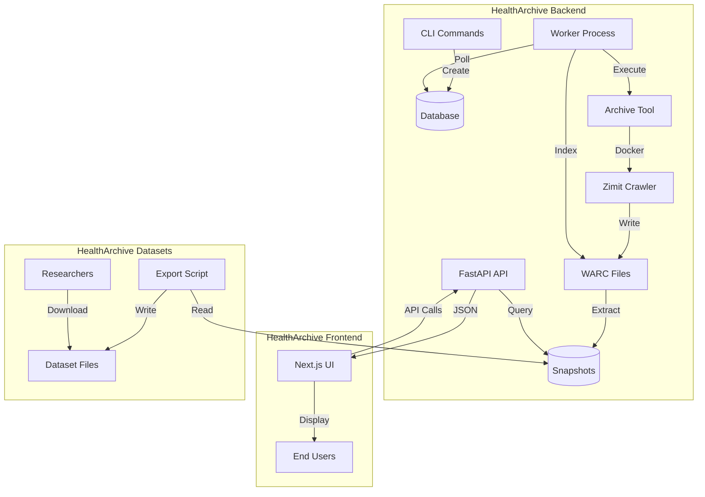

# HealthArchive Documentation Hub

HealthArchive is a **multi-repo project** that archives Canadian health government websites for research and accountability. This page helps you navigate the documentation across all repositories.

---

## 🚀 Quick Start by Role

Choose your entry point based on what you want to do:

### 👤 I'm an Operator

**Goal**: Deploy, monitor, and maintain the production system

**Start Here**:
1. [Production Runbook](deployment/production-single-vps.md) - Complete production setup guide
2. [Operator Responsibilities](operations/playbooks/operator-responsibilities.md) - Must-do checklist
3. [Deploy & Verify](operations/playbooks/deploy-and-verify.md) - Safe deployment process
4. [Incident Response](operations/playbooks/incident-response.md) - Emergency procedures

**Key Resources**:
- [Ops Cadence Checklist](operations/ops-cadence-checklist.md) - Daily/weekly/quarterly tasks
- [Monitoring Checklist](operations/monitoring-and-ci-checklist.md) - Set up alerts and checks
- [All Playbooks](operations/playbooks/README.md) - 30+ operational procedures

---

### 💻 I'm a Developer

**Goal**: Contribute code, fix bugs, add features

**Start Here**:
1. [Quick Start Guide](quickstart.md) - Get running in 5 minutes
2. [Your First Contribution](tutorials/first-contribution.md) - Step-by-step tutorial
3. [Dev Environment Setup](development/dev-environment-setup.md) - Detailed local setup
4. [Live Testing Guide](development/live-testing.md) - Run the full pipeline locally

**Key Resources**:
- [Architecture Walkthrough](tutorials/architecture-walkthrough.md) - Visual guide to how it all works
- [Architecture Deep Dive](architecture.md) - Complete technical reference
- [Testing Guidelines](development/testing-guidelines.md) - How to write and run tests
- [Contributing Guide](CONTRIBUTING.md) - Code standards and workflow

---

### 🔧 I'm an API Consumer / Researcher

**Goal**: Search the archive and retrieve historical snapshots

**Start Here**:
1. [API Consumer Guide](api-consumer-guide.md) - Complete API walkthrough with examples
2. [Interactive API Docs](https://api.healtharchive.ca/docs) - Try the API in your browser
3. [API Reference](api.md) - Full OpenAPI specification

**Quick API Test**:
```bash
curl "https://api.healtharchive.ca/api/search?q=vaccines&source=hc"
```

**Key Resources**:
- **Dataset Downloads**: [healtharchive-datasets](https://github.com/jerdaw/healtharchive-datasets) - Bulk metadata exports
- [Data Handling Policy](operations/data-handling-and-retention.md) - Retention and privacy
- **Live Site**: [healtharchive.ca](https://healtharchive.ca) - Web interface

---

### 📚 I'm a Student / New to the Project

**Goal**: Learn how HealthArchive works

**Recommended Reading Order**:
1. [Quick Start](quickstart.md) - High-level overview
2. [Architecture Walkthrough](tutorials/architecture-walkthrough.md) - Follow a page from crawl to search
3. [Architecture Reference](architecture.md) - Deep technical details
4. [Documentation Guidelines](documentation-guidelines.md) - How docs stay organized

**Tutorials**:
- [Your First Contribution](tutorials/first-contribution.md) - Hands-on coding tutorial
- [Debugging a Failed Crawl](tutorials/debug-crawl.md) - Practical troubleshooting
- [Live Testing](development/live-testing.md) - Run it yourself locally

---

## 📦 Multi-Repo Architecture

HealthArchive is split across three repositories with clear boundaries:

### 🔙 Backend (This Repo)

**Purpose**: API, crawler, database, operations, and all internal infrastructure

**Location**: [github.com/jerdaw/healtharchive-backend](https://github.com/jerdaw/healtharchive-backend)

**Documentation**: [docs.healtharchive.ca](https://docs.healtharchive.ca) (you are here)

**What Lives Here**:
- ✅ Crawler (archive_tool) and job orchestration
- ✅ Database models and indexing pipeline
- ✅ RESTful JSON API (FastAPI)
- ✅ Operations runbooks and playbooks
- ✅ Deployment guides and systemd units
- ✅ Architecture and developer docs
- ✅ Decision records and incident notes

**Tech Stack**: Python, FastAPI, SQLAlchemy, PostgreSQL, Docker, systemd

---

### 🌐 Frontend

**Purpose**: Public-facing website and user interface

**Location**: [github.com/jerdaw/healtharchive-frontend](https://github.com/jerdaw/healtharchive-frontend)

**Live Site**: [healtharchive.ca](https://healtharchive.ca)

**What Lives Here**:
- ✅ Next.js web application (search UI, snapshot viewer)
- ✅ Public content (status page, impact statement, changelog)
- ✅ Internationalization (i18n) - English and French
- ✅ UI/UX documentation

**Tech Stack**: Next.js 16, React, TypeScript, Tailwind CSS

**Frontend Docs in This Repo** (pointers only):
- [Frontend Overview](frontend-external/README.md)
- [I18n Guide](frontend-external/i18n.md)
- [Implementation Guide](frontend-external/implementation-guide.md)

**Canonical Frontend Docs**: [frontend/docs/](https://github.com/jerdaw/healtharchive-frontend/tree/main/docs)

---

### 📊 Datasets

**Purpose**: Versioned, citable metadata-only dataset releases

**Location**: [github.com/jerdaw/healtharchive-datasets](https://github.com/jerdaw/healtharchive-datasets)

**What Lives Here**:
- ✅ Snapshot metadata exports (JSON/CSV)
- ✅ Checksums and integrity manifests
- ✅ Dataset release documentation
- ✅ Dataset integrity policies

**Why Separate?**: Enables versioned, citable releases independent of code changes

**Datasets Docs in This Repo**: [datasets-external/README.md](datasets-external/README.md) (pointer only)

**Canonical Datasets Docs**: [datasets/README.md](https://github.com/jerdaw/healtharchive-datasets/blob/main/README.md)

---

## 🗺️ Where Things Live (Source of Truth Map)

| Content Type | Lives In | Link |
|--------------|----------|------|
| **Operations & Runbooks** | Backend repo | [docs.healtharchive.ca/operations](https://docs.healtharchive.ca/operations/) |
| **Architecture & Dev Guides** | Backend repo | [docs.healtharchive.ca/architecture](https://docs.healtharchive.ca/architecture/) |
| **API Documentation** | Backend repo | [docs.healtharchive.ca/api](https://docs.healtharchive.ca/api/) |
| **Public Changelog** | Frontend repo | [github.com/jerdaw/healtharchive-frontend/.../changelog-process.md](https://github.com/jerdaw/healtharchive-frontend/blob/main/docs/changelog-process.md) |
| **Status Page** | Frontend repo (code) | [github.com/jerdaw/healtharchive-frontend/.../status/page.tsx](https://github.com/jerdaw/healtharchive-frontend/blob/main/src/app/%5Blocale%5D/status/page.tsx) |
| **Impact Statement** | Frontend repo (code) | [github.com/jerdaw/healtharchive-frontend/.../impact/page.tsx](https://github.com/jerdaw/healtharchive-frontend/blob/main/src/app/%5Blocale%5D/impact/page.tsx) |
| **Dataset Releases** | Datasets repo | [github.com/jerdaw/healtharchive-datasets](https://github.com/jerdaw/healtharchive-datasets) |
| **I18n Guidelines** | Frontend repo | [github.com/jerdaw/healtharchive-frontend/.../i18n.md](https://github.com/jerdaw/healtharchive-frontend/blob/main/docs/i18n.md) |

**Principle**: Each doc has one canonical source. Other repos link to it.

---

## 🔗 Cross-Repo Linking

### In GitHub Issues/PRs

Use full GitHub URLs:
```markdown
See the [production runbook](https://github.com/jerdaw/healtharchive-backend/blob/main/docs/deployment/production-single-vps.md)
```

### In Documentation

**For docs users**: Use the docs site URLs:
```markdown
See the [Production Runbook](https://docs.healtharchive.ca/deployment/production-single-vps/)
```

**For cross-repo references**: Use full GitHub URLs:
```markdown
Frontend changelog process: [changelog-process.md](https://github.com/jerdaw/healtharchive-frontend/blob/main/docs/changelog-process.md)
```

### Local Development (Multi-Repo Workspace)

If you have all repos cloned as siblings:
```
/home/user/healtharchive/
├── healtharchive-backend/
├── healtharchive-frontend/
└── healtharchive-datasets/
```

Some docs use relative paths like `../healtharchive-frontend/...` for convenience.

**Note**: These paths only work in local workspaces, not on GitHub.

---

## 🏗️ System Architecture (High Level)



**Data Flow**:
1. **Crawl**: CLI creates job → Worker runs crawler → Docker writes WARCs
2. **Index**: Worker parses WARCs → Extracts text → Stores snapshots in DB
3. **Serve**: API queries DB → Returns JSON → Frontend displays results
4. **Export**: Scripts export metadata → Version as datasets → Researchers download

**See**: [Architecture Walkthrough](tutorials/architecture-walkthrough.md) for detailed data flow

---

## 📖 Documentation Structure

This documentation follows the [Diátaxis framework](https://diataxis.fr/) for clarity:

| Type | Purpose | Where |
|------|---------|-------|
| **Tutorials** | Learning-oriented, step-by-step | [tutorials/](tutorials/) |
| **How-To Guides** | Task-oriented, problem-solving | [operations/playbooks/](operations/playbooks/), [development/](development/) |
| **Reference** | Information-oriented, lookup | [api.md](api.md), [architecture.md](architecture.md), [reference/](reference/) |
| **Explanation** | Understanding-oriented, concepts | [documentation-guidelines.md](documentation-guidelines.md), [decisions/](decisions/), [operations/](operations/) |

**Navigation**: Use the sidebar to explore by category

---

## 🆘 Getting Help

### By Issue Type

| Issue | Where to Go |
|-------|-------------|
| **API questions** | [API Consumer Guide](api-consumer-guide.md) → [API Docs](https://api.healtharchive.ca/docs) |
| **Deployment problems** | [Production Runbook](deployment/production-single-vps.md) → [Playbooks](operations/playbooks/README.md) |
| **Code questions** | [Architecture Guide](architecture.md) → [GitHub Discussions](https://github.com/jerdaw/healtharchive-backend/discussions) |
| **Bugs or feature requests** | [GitHub Issues](https://github.com/jerdaw/healtharchive-backend/issues) |
| **Operational incidents** | [Incident Response](operations/playbooks/incident-response.md) |

### Community

- **GitHub Discussions**: [backend](https://github.com/jerdaw/healtharchive-backend/discussions) | [frontend](https://github.com/jerdaw/healtharchive-frontend/discussions)
- **Issues**: [backend](https://github.com/jerdaw/healtharchive-backend/issues) | [frontend](https://github.com/jerdaw/healtharchive-frontend/issues) | [datasets](https://github.com/jerdaw/healtharchive-datasets/issues)
- **Contributor Guide**: [CONTRIBUTING.md](CONTRIBUTING.md)

---

## 🔄 Documentation Updates

**Found something wrong?** Documentation lives in git and accepts pull requests!

1. **Backend docs**: Edit files in [`docs/`](https://github.com/jerdaw/healtharchive-backend/tree/main/docs)
2. **Frontend docs**: Edit files in [frontend `docs/`](https://github.com/jerdaw/healtharchive-frontend/tree/main/docs)
3. **Datasets docs**: Edit [datasets README](https://github.com/jerdaw/healtharchive-datasets/blob/main/README.md)

**Guidelines**: [Documentation Guidelines](documentation-guidelines.md)

---

## 📊 Project Status

| Metric | Value | Details |
|--------|-------|---------|
| **Snapshots Archived** | Check [/api/stats](https://api.healtharchive.ca/api/stats) | Live count |
| **Sources** | 2 (Health Canada, PHAC) | [/api/sources](https://api.healtharchive.ca/api/sources) |
| **Crawl Frequency** | Annual + ad-hoc | [Ops Roadmap](operations/healtharchive-ops-roadmap.md) |
| **API Status** | Production | [Health Check](https://api.healtharchive.ca/api/health) |
| **Frontend Status** | Production | [healtharchive.ca](https://healtharchive.ca) |

**Latest Incidents**: See [operations/incidents/](operations/incidents/)

---

## 🎯 Next Steps

Based on your role, here's what to do next:

### Operators
1. ✅ Review [Production Runbook](deployment/production-single-vps.md)
2. ✅ Complete [Monitoring Checklist](operations/monitoring-and-ci-checklist.md)
3. ✅ Bookmark [Incident Response](operations/playbooks/incident-response.md)

### Developers
1. ✅ Complete [Quick Start](quickstart.md)
2. ✅ Follow [Your First Contribution](tutorials/first-contribution.md)
3. ✅ Read [Architecture Walkthrough](tutorials/architecture-walkthrough.md)

### Researchers
1. ✅ Read [API Consumer Guide](api-consumer-guide.md)
2. ✅ Try [Interactive API Docs](https://api.healtharchive.ca/docs)
3. ✅ Explore [Datasets](https://github.com/jerdaw/healtharchive-datasets)

---

## 📚 Essential Documentation Index

**Getting Started**:
- [Quick Start](quickstart.md)
- [Project Overview](project.md) (you are here)

**For Operators**:
- [Production Runbook](deployment/production-single-vps.md)
- [All Playbooks](operations/playbooks/README.md)
- [Ops Cadence](operations/ops-cadence-checklist.md)

**For Developers**:
- [First Contribution](tutorials/first-contribution.md)
- [Architecture Guide](architecture.md)
- [Dev Setup](development/dev-environment-setup.md)

**For Researchers**:
- [API Guide](api-consumer-guide.md)
- [API Reference](api.md)
- [Datasets](https://github.com/jerdaw/healtharchive-datasets)

**Reference**:
- [Documentation Guidelines](documentation-guidelines.md)
- [Decision Records](decisions/README.md)
- [Roadmaps](roadmaps/README.md)

---

## 💡 About This Documentation

This documentation portal is built with [MkDocs Material](https://squidfunk.github.io/mkdocs-material/) and deployed to [docs.healtharchive.ca](https://docs.healtharchive.ca).

**Source**: [docs/](https://github.com/jerdaw/healtharchive-backend/tree/main/docs)
**Build**: `make docs-build`
**Serve Locally**: `make docs-serve`

**Last Updated**: Auto-generated on every push to `main`
