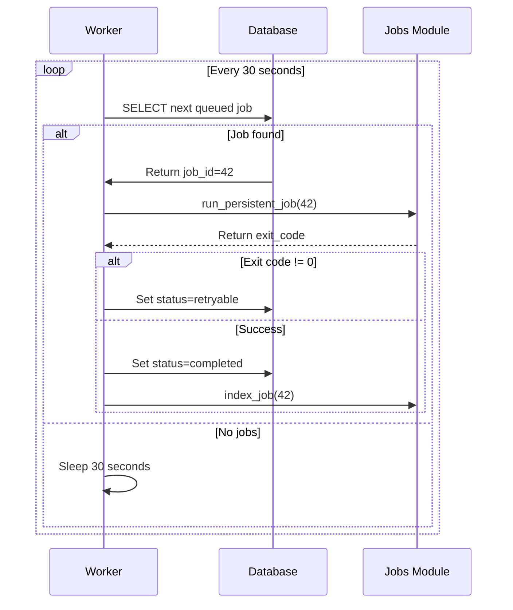
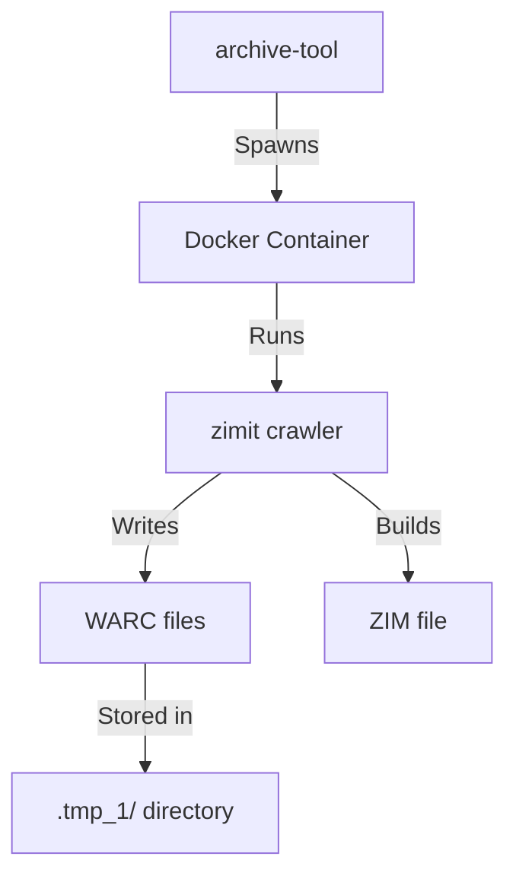
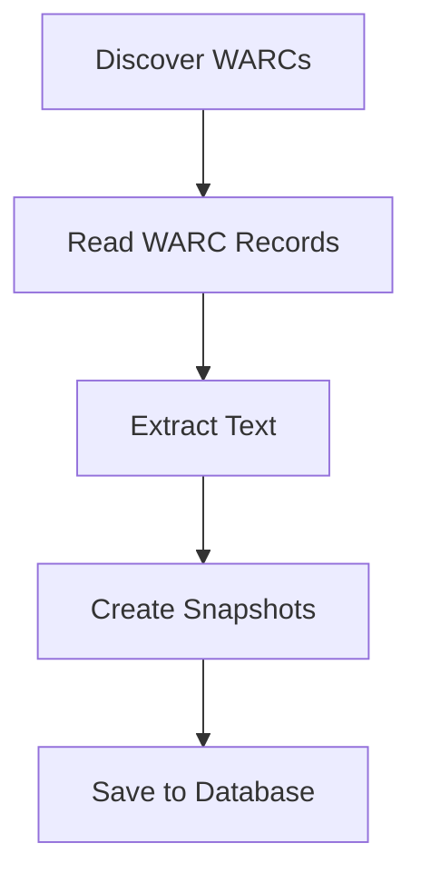
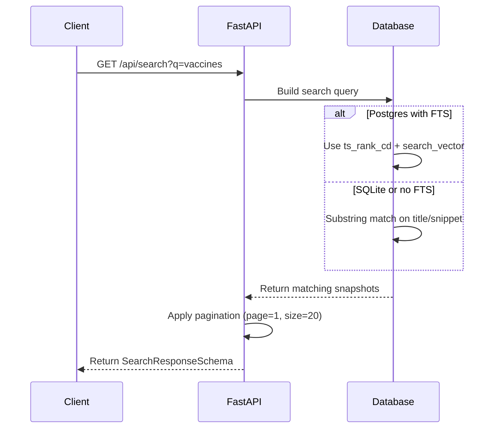
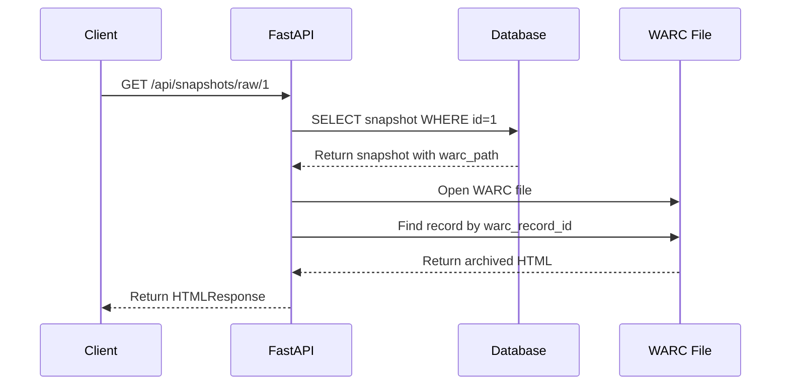
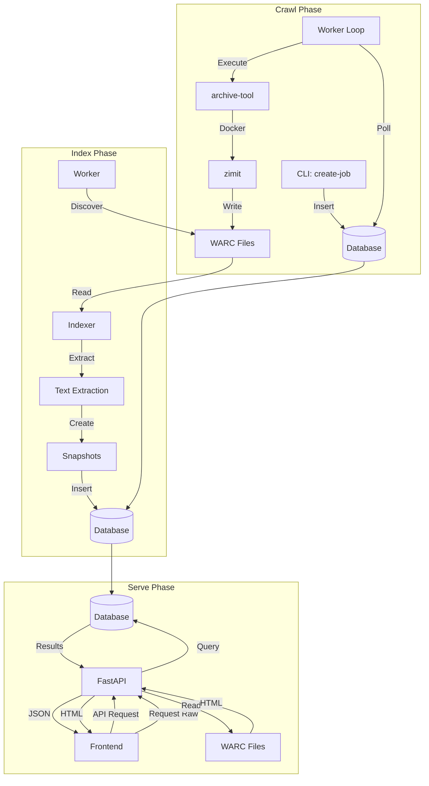

# Architecture Walkthrough

Learn how HealthArchive works by following a web page from crawl to search result.

**Time**: 20-30 minutes
**Skill Level**: Beginner to intermediate
**Prerequisites**: Basic understanding of web applications and databases

---

## Overview: The Big Picture

HealthArchive preserves Canadian health government websites through a multi-stage pipeline:


Let's walk through what happens when we archive a page from Health Canada.

---

## Step 1: Job Creation

Everything starts with creating an **ArchiveJob**.

```bash
ha-backend create-job --source hc
```

**What happens:**

1. **Job Registry** (` ha_backend/job_registry.py:312-332`) looks up configuration for source code `"hc"`:
   - Default seeds: `["https://www.canada.ca/en/health-canada.html"]`
   - Initial workers: `1`
   - Tool options: monitoring, adaptive workers, etc.

2. **Job Creation** (`ha_backend/job_registry.py:400-420`):
   - Generates job name: `hc-20260118` (using today's date)
   - Creates output directory: `/mnt/nasd/nobak/healtharchive/jobs/hc/20260118T210911Z__hc-20260118`
   - Inserts `ArchiveJob` row with `status="queued"`

**Database state after creation:**

```
┌────┬────────────┬──────────┬─────────────────────────────────┐
│ id │ name       │ status   │ output_dir                      │
├────┼────────────┼──────────┼─────────────────────────────────┤
│ 42 │ hc-20260118│ queued   │ /mnt/.../20260118T...hc-20260118│
└────┴────────────┴──────────┴─────────────────────────────────┘
```

---

## Step 2: Worker Picks Up the Job

The worker runs continuously, polling for queued jobs:

```bash
ha-backend start-worker --poll-interval 30
```

**Worker Loop** (`ha_backend/worker/main.py:1087-1140`):



---

## Step 3: Running the Crawler

**Job Execution** (`ha_backend/jobs.py:439-560`):

1. **Load job config** from database:
   ```json
   {
     "seeds": ["https://www.canada.ca/en/health-canada.html"],
     "tool_options": {
       "initial_workers": 2,
       "cleanup": false,
       "enable_monitoring": false,
       "skip_final_build": true
     }
   }
   ```

2. **Build CLI command**:
   ```bash
   archive-tool \
     --name hc-20260118 \
     --output-dir /mnt/.../20260118T...hc-20260118 \
     --initial-workers 2 \
     https://www.canada.ca/en/health-canada.html
   ```

3. **Execute as subprocess** (`jobs.py:529-542`):
   - Spawns `archive-tool` process
   - Streams output to logs
   - Waits for completion

---

## Step 4: Archive Tool Crawls

The **archive_tool** (separate subpackage) orchestrates Docker:



**Key files created** (see `src/archive_tool/docs/documentation.md`):

```
output_dir/
├── .archive_state.json          # Tracks crawl state
├── .tmp_1/                      # Temporary crawl artifacts
│   └── collections/
│       └── crawl-20260118.../
│           └── archive/
│               ├── rec-00000-20260118.warc.gz
│               ├── rec-00001-20260118.warc.gz
│               └── ...
└── zim/
    └── hc-20260118_2026-01-18.zim
```

**What's in a WARC?**

WARC (Web ARChive) files contain:
- HTTP request/response pairs
- Headers and content
- Capture timestamps
- Record metadata

Example WARC record:
```
WARC/1.0
WARC-Type: response
WARC-Date: 2026-01-18T21:15:42Z
WARC-Record-ID: <urn:uuid:12345...>
Content-Type: application/http; msgtype=response

HTTP/1.1 200 OK
Content-Type: text/html; charset=utf-8
Content-Length: 45678

<!DOCTYPE html>
<html lang="en">
  <head><title>Health Canada</title></head>
  <body>...actual page content...</body>
</html>
```

---

## Step 5: Crawl Completes

When `archive-tool` exits:

1. **Exit code 0** (success):
   - Worker sets `job.status = "completed"`
   - Worker sets `job.crawler_exit_code = 0`
   - Worker proceeds to indexing

2. **Exit code != 0** (failure):
   - Worker checks `retry_count < MAX_CRAWL_RETRIES`
   - If retries available: set `status = "retryable"`
   - Otherwise: set `status = "failed"`

**Database state after successful crawl:**

```
┌────┬─────────────┬───────────┬──────────────┬───────────┐
│ id │ name        │ status    │ crawler_exit │ warc_count│
├────┼─────────────┼───────────┼──────────────┼───────────┤
│ 42 │ hc-20260118 │ completed │ 0            │ NULL      │
└────┴─────────────┴───────────┴──────────────┴───────────┘
```

---

## Step 6: WARC Indexing

The worker automatically calls `index_job(42)` after successful crawl.

**Indexing Pipeline** (`ha_backend/indexing/pipeline.py:743-778`):



### 6.1 WARC Discovery

**Discovery process** (`ha_backend/indexing/warc_discovery.py:660-689`):

1. Load crawl state from `.archive_state.json`
2. Get temporary directories from state
3. Find all `*.warc.gz` files in temp dirs
4. Return list of WARC paths

```python
warc_paths = discover_warcs_for_job(job)
# Returns: [
#   Path("/mnt/.../rec-00000-20260118.warc.gz"),
#   Path("/mnt/.../rec-00001-20260118.warc.gz"),
# ]
```

### 6.2 Reading WARC Records

**WARC Reader** (`ha_backend/indexing/warc_reader.py`):

```python
for record in iter_html_records(warc_path):
    # record.url = "https://www.canada.ca/en/health-canada.html"
    # record.capture_timestamp = datetime(2026, 1, 18, 21, 15, 42)
    # record.body_bytes = b"<!DOCTYPE html>..."
    # record.warc_record_id = "<urn:uuid:12345...>"
```

### 6.3 Text Extraction

**Text Extraction** (`ha_backend/indexing/text_extraction.py`):

```python
# Decode HTML
html = record.body_bytes.decode("utf-8", errors="replace")

# Extract metadata
title = extract_title(html)
# Returns: "Health Canada - Canada.ca"

text = extract_text(html)
# Returns: "Health Canada\nAbout Health Canada\n..."

snippet = make_snippet(text)
# Returns: "Health Canada works to help Canadians maintain..."

language = detect_language(text, record.headers)
# Returns: "en"
```

### 6.4 Creating Snapshots

**Mapping** (`ha_backend/indexing/mapping.py:724-739`):

```python
snapshot = Snapshot(
    job_id=42,
    source_id=1,  # hc
    url=record.url,
    normalized_url_group=normalize_url(record.url),
    capture_timestamp=record.capture_timestamp,
    title=title,
    snippet=snippet,
    language=language,
    warc_path=str(record.warc_path),
    warc_record_id=record.warc_record_id,
    mime_type="text/html",
    status_code=200,
)
session.add(snapshot)
```

### 6.5 Database Result

**After indexing all WARC records:**

```
snapshots table:
┌────┬────────┬─────────┬──────────────────────────────┬──────────────────────┬─────────┐
│ id │ job_id │ source  │ url                          │ title                │ language│
├────┼────────┼─────────┼──────────────────────────────┼──────────────────────┼─────────┤
│ 1  │ 42     │ hc      │ https://www.canada.ca/...    │ Health Canada        │ en      │
│ 2  │ 42     │ hc      │ https://www.canada.ca/...    │ About Health Canada  │ en      │
│ 3  │ 42     │ hc      │ https://www.canada.ca/...    │ Services             │ en      │
│ ...│ ...    │ ...     │ ...                          │ ...                  │ ...     │
└────┴────────┴─────────┴──────────────────────────────┴──────────────────────┴─────────┘

archive_jobs table:
┌────┬─────────────┬─────────┬──────────────┬────────────────────┐
│ id │ name        │ status  │ warc_count   │ indexed_page_count │
├────┼─────────────┼─────────┼──────────────┼────────────────────┤
│ 42 │ hc-20260118 │ indexed │ 245          │ 12,347             │
└────┴─────────────┴─────────┴──────────────┴────────────────────┘
```

---

## Step 7: Serving via API

Now the indexed snapshots are searchable via the public API.

### 7.1 Search Request

```bash
curl "https://api.healtharchive.ca/api/search?q=vaccines&sort=relevance"
```

**API Route** (`ha_backend/api/routes_public.py:885-946`):



### 7.2 Query Building

**For Postgres** (with full-text search):

```sql
SELECT *
FROM snapshots
WHERE search_vector @@ websearch_to_tsquery('english', 'vaccines')
  AND source_id = (SELECT id FROM sources WHERE code = 'hc')
  AND (status_code IS NULL OR status_code BETWEEN 200 AND 299)
ORDER BY ts_rank_cd(search_vector, websearch_to_tsquery('english', 'vaccines')) DESC
LIMIT 20 OFFSET 0;
```

**For SQLite** (substring matching):

```sql
SELECT *
FROM snapshots
WHERE (
    LOWER(title) LIKE '%vaccines%'
    OR LOWER(snippet) LIKE '%vaccines%'
    OR LOWER(url) LIKE '%vaccines%'
  )
  AND source_id = (SELECT id FROM sources WHERE code = 'hc')
  AND (status_code IS NULL OR status_code BETWEEN 200 AND 299)
ORDER BY
    CASE
        WHEN LOWER(title) LIKE '%vaccines%' THEN 3
        WHEN LOWER(url) LIKE '%vaccines%' THEN 2
        ELSE 1
    END DESC,
    capture_timestamp DESC
LIMIT 20 OFFSET 0;
```

### 7.3 Response Format

```json
{
  "results": [
    {
      "id": 1,
      "title": "COVID-19 vaccines: Authorization and safety",
      "sourceCode": "hc",
      "sourceName": "Health Canada",
      "language": "en",
      "captureDate": "2026-01-18T21:15:42Z",
      "originalUrl": "https://www.canada.ca/en/health-canada/services/drugs-health-products/covid19-industry/drugs-vaccines-treatments/vaccines.html",
      "snippet": "Health Canada has approved COVID-19 vaccines for use in Canada...",
      "rawSnapshotUrl": "/api/snapshots/raw/1"
    }
  ],
  "total": 127,
  "page": 1,
  "pageSize": 20
}
```

---

## Step 8: Viewing Archived Content

When a user clicks a search result, the frontend requests the archived HTML:

```bash
curl "https://api.healtharchive.ca/api/snapshots/raw/1"
```

**Replay Process** (`ha_backend/indexing/viewer.py:782-799`):



**Output**: The archived HTML exactly as it was captured, with a HealthArchive banner added for context.

---

## System Architecture Diagram

Putting it all together:



---

## Key Components Summary

| Component | Location | Role |
|-----------|----------|------|
| **Job Registry** | `ha_backend/job_registry.py` | Source configs, job creation |
| **Worker** | `ha_backend/worker/main.py` | Job polling and execution |
| **Jobs Module** | `ha_backend/jobs.py` | Runs archive-tool subprocess |
| **Archive Tool** | `src/archive_tool/` | Docker orchestration, crawling |
| **WARC Discovery** | `ha_backend/indexing/warc_discovery.py` | Find WARC files |
| **WARC Reader** | `ha_backend/indexing/warc_reader.py` | Stream WARC records |
| **Text Extraction** | `ha_backend/indexing/text_extraction.py` | Extract title/text/snippet |
| **Indexer** | `ha_backend/indexing/pipeline.py` | Orchestrate indexing |
| **Public API** | `ha_backend/api/routes_public.py` | Search, stats, snapshots |
| **Admin API** | `ha_backend/api/routes_admin.py` | Job management |
| **Database Models** | `ha_backend/models.py` | ORM definitions |

---

## Data Flow Summary

1. **Create**: CLI creates `ArchiveJob` → database
2. **Queue**: Worker polls → finds queued job
3. **Crawl**: Worker runs `archive-tool` → writes WARCs
4. **Discover**: Indexer finds WARCs in output directory
5. **Extract**: Parse WARCs → extract text and metadata
6. **Store**: Create `Snapshot` rows → database
7. **Search**: API queries snapshots → returns results
8. **View**: API reads WARC → serves archived HTML

---

## Next Steps

Now that you understand the architecture:

1. **Try it locally**: Follow [Live Testing](../development/live-testing.md) to run the pipeline
2. **Debug a crawl**: See [Debugging a Failed Crawl](debug-crawl.md)
3. **Dive deeper**: Read the full [Architecture Guide](../architecture.md)
4. **Explore the code**: Browse the components in the table above

---

## Further Reading

- **Archive Tool Internals**: `src/archive_tool/docs/documentation.md`
- **WARC Format**: [WARC specification](https://iipc.github.io/warc-specifications/)
- **Full-Text Search**: PostgreSQL `tsvector` and `ts_rank_cd` docs
- **FastAPI**: [FastAPI documentation](https://fastapi.tiangolo.com/)

---

## Questions?

- **How do I add a new source?** See `ha_backend/job_registry.py` and add to `SOURCE_CONFIGS`
- **How do I customize crawl options?** Modify `default_tool_options` in source config
- **How do I improve search ranking?** Review search logic in `routes_public.py:885-946`
- **Where are WARCs stored long-term?** In the job's output directory under `archive_root`

Still have questions? Check the [How-To Guides](../operations/README.md) or ask in GitHub Discussions.
